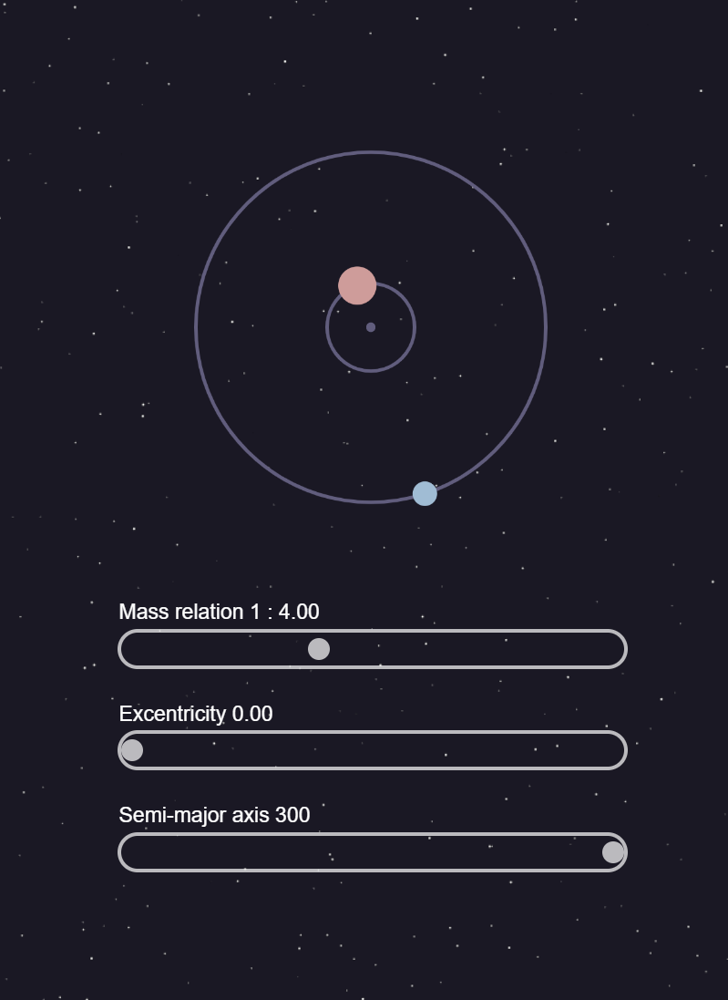

# Orbit Visualizer

Original idea by [elplanetaerrante](https://www.instagram.com/elplanetaerrante/).

# Implementation

First prototype

Seccond prototype

Current version

[Prototype here](https://luckbox314.github.io/orbit_visualizer/)

[Source code here](https://github.com/Luckbox314/orbit_visualizer)

# Details to add

- [x]  Change the color of the barycenter to better differentiate it from the stars.
- [x]  Add mention to elplanetaerrante
- [x]  Add tool tips with explanation on what is each variable.
- [x]  Add a bit of space on top.
- [x]  Make sliders bigger for mobile.
- [x]  Change github link to repo link.
- [x]  Fix orbital period

# Simulation

The process of simulating the two body problem in real time with the mass ratio, excentricity and semi-major axis as parameters was not an easy task. Fortunatelly I was able to come with a solution to do this, that works well enough to give an aqurate representation of the orbits in real time.

The orbit of the blue planet is created based on it’s excentricity and semi-mayor axis. It’s right foci is centered in the canvas. This foci will become the baricenter later.

While the orbit itself is easy to create, ensuring that the planet moves at the right speed at each time is not. For this we need the funtion $r(t)$ (position based on time).
The [Law of Areas](http://hyperphysics.phy-astr.gsu.edu/hbase/kepler.html#c5) becomes important now.

> A line that connects a planet to the sun sweeps out equal areas in equal times.
> 

Adapting it to a two body problem where the center is not the sun but the baricenter. With this we know that $t(A)$ is linear (time based on area swept) so it’s enough to get an $r(A)$ (time based on the area) to get a propper scale of time for our position.

Since we know the position based on an angle:

$$
r(\theta) = \frac{a\cdot(1-e^2)}{1 + e \cdot \cos(\theta)}
$$

<aside>
❓ this is the position in polar coordinates centered in the foci with $e$ the eccentricity and $a$ the semi mayor axis

</aside>

If we can get the angle based on an area ($\theta(A)$) then we’ll have our $r(A)$

To calculate this we first can get $A(\theta)$ by integrating the radious over delta  $\theta$

$$
A(\theta) = \int \frac{r(\theta)^2}{2}d\theta
$$

$$
A(\theta) = \frac{a^2(e^3 - e) \sin(\theta)}{2e\cos(\theta) + 2} + a^2\sqrt{1 - e}\sqrt{e + 1}  \cdot\arctan((\frac{\sqrt{1-e}}{\sqrt{e + 1}} \tan(\theta/2))
$$

Since getting the inverse of $A(\theta)$ is really complicated, we decided to use an empirical aproach. We subdivide the orbit in $n$ segments of equal angle. then we calculate the area of each angle with $A(\theta)$, then we use that to interpolate the angle for a given area. Let’s call this aproximation: $\theta_{A(\theta)}(A)$.

With $\theta_{A(\theta)}(A)$ we can have an $r_{A(\theta)}(A)$ using $r(\theta_{A(\theta)}(A))$.

With this we can calculate the position of the blue planet for any given area swept, now we just animate the area going from 0% of the elipse to 100% in a linear manner and we get a proportional movement for the planet.

With the position of the blue planet, we can get the position of the red planet by simply using the fact that the center of mass of both will stay at the baricenter.

$$
pos_{red} = baricenter - r_{A(\theta)}(A)\frac{m_{blue}}{m_{red}}
$$

Thanks to that we can know the position of the two planets at any time based on the semi mayor axis and the eccentricity. The mass ratio between the planets comes into play because it dictates the semi mayor axis of the orbit used to calculate the orbital period.
